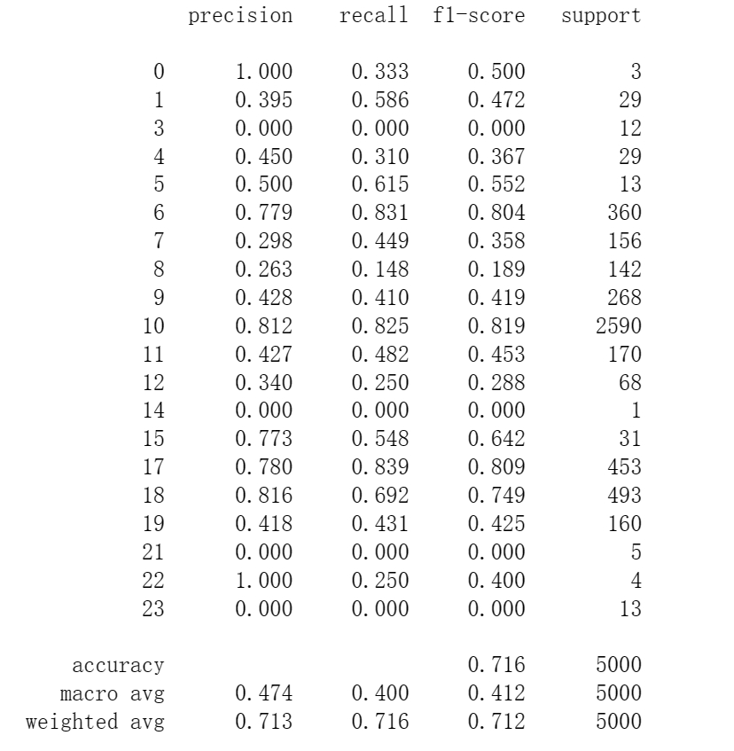
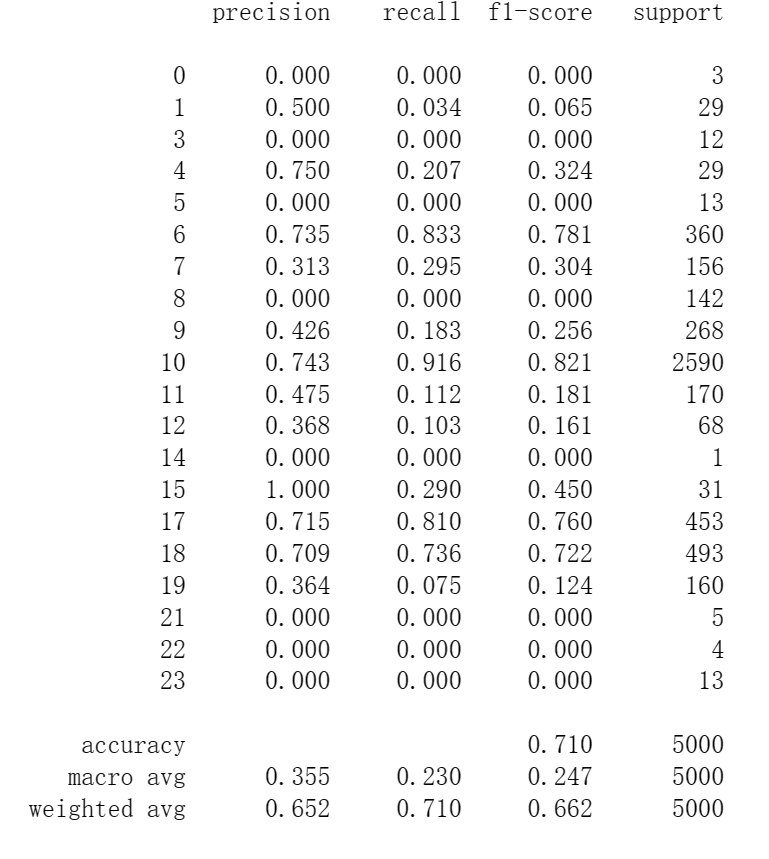
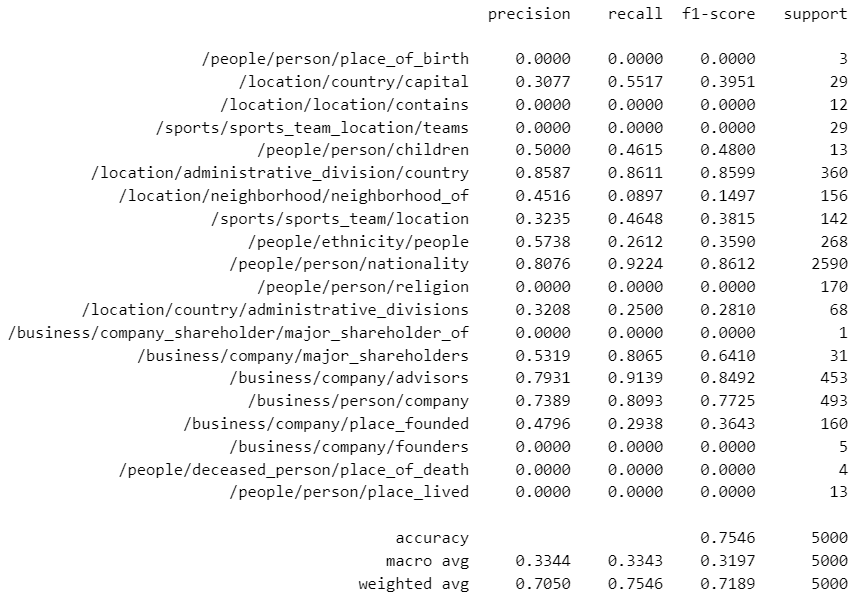
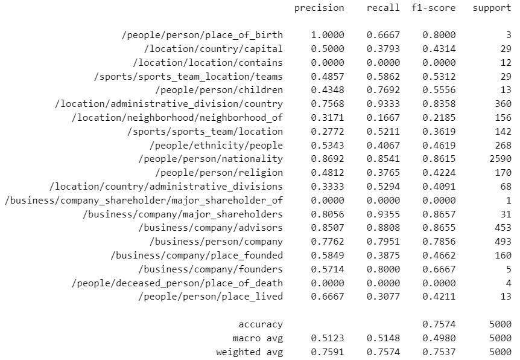

# Relation Extraction (COMP61332 Group Coursework)
  This Project is temporarily used for the group coursework, which contains two function of Relation extraction.
  1. [BiLSTM](model_code/BILSTM.ipynb), 2. [Bert (pretrained model: bert-base-cased)](model_code/BERT.ipynb)
# Group Member:
  Junfan Cheng, Tong Shen, Qiujie Xu, Yuxuan Zhang

# Dataset
  The dataset applied in this project is only the "NYT" part of [UniRel Model](https://github.com/wtangdev/UniRel/blob/main/README.md), which data can also be downloaded from [the shared drive link](https://drive.google.com/file/d/1-3uBc_VfaCEWO2_FegzSyBXNeFmqhv7x/view)
  
  The dataset is originally obtained from TPLinker, refer to [TPLinker officail repository](https://github.com/131250208/TPlinker-joint-extraction). 
  
  The path of dataset files: ./model_data

# Trained Model file
  The trained model of this assignment has been upload.
  1: BiLSTM (./trained_model/BiLSTM_xxxx.h5)
  2: As the size of bert model overs the limitation of github, the result can be found by [this link](https://drive.google.com/drive/folders/17gy7A6w-dHqTzw7Bmkcfe4H0ApJ1ePSE?usp=drive_link).

# How to use this model to predict realtions with any input
  For every model code provided, there exists a section named "Predictor" where users are allowed to modify the input sentence within the predictor method located in the final code cell. Prior to conducting any tests, it's imperative that users execute the initial cell of the Jupyter notebook to install all necessary dependencies from the requirements file. Subsequently, the cells under the "Predictor" section should be run sequentially. The predict result will be shown as the output of last cell.

# Improvements
  1. To enhance the original BiLSTM version, we integrated an additional attention layer to enhance its capability to focus on relevant labels and avoid concentrating on meaningless ones. The results displayed below demonstrate that this method is a promising approach to improve the performance of BiLSTM.

  2. Bert

# Result and Evaluation
  The Following picture shows the result of different Relation extraction model, the evaluation standard is based on the F1 score.

  BiLSTM: The result of BiLSTM with attention (left) and without attention (right) on the test dataset.
  
   


  BERT: The result of Bert with xxx (left) and without xxx (right) on the test dataset.
  
   
  

# Citation
```
@inproceedings{tang-etal-2022-unirel,
    title = "{U}ni{R}el: Unified Representation and Interaction for Joint Relational Triple Extraction",
    author = "Tang, Wei  and
      Xu, Benfeng  and
      Zhao, Yuyue  and
      Mao, Zhendong  and
      Liu, Yifeng  and
      Liao, Yong  and
      Xie, Haiyong",
    booktitle = "Proceedings of the 2022 Conference on Empirical Methods in Natural Language Processing",
    month = dec,
    year = "2022",
    address = "Abu Dhabi, United Arab Emirates",
    publisher = "Association for Computational Linguistics",
    url = "https://aclanthology.org/2022.emnlp-main.477",
    pages = "7087--7099",
}
```
```
@article{nayak2019effective,
  title={Effective attention modeling for neural relation extraction},
  author={Nayak, Tapas and Ng, Hwee Tou},
  journal={arXiv preprint arXiv:1912.03832},
  year={2019}
}
```
